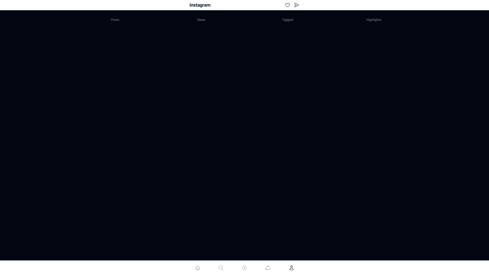
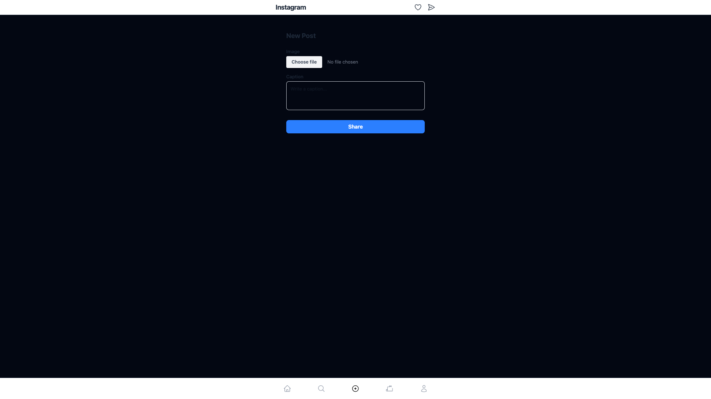

# Insta Clone — Frontend

A full-stack Instagram clone built as an onboarding project at Webeet. The app replicates core Instagram features: a scrollable post feed, profile page with tabbed grids, stories/highlights, reels, and post creation with image upload.

> **Backend repo:** [insta-clone-fastify-backend](https://github.com/stuartmclean1/insta-clone-fastify-backend)

---

## Screenshots

| Feed | Profile | Create Post |
|------|---------|-------------|
|  |  |  |

---

## Tech Stack

| Layer | Technology |
|-------|-----------|
| Language | TypeScript |
| Framework | React 19 + React Router v7 (SSR) |
| Styling | Tailwind CSS v4 |
| State | Zustand |
| Validation | Zod |
| HTTP client | Axios |
| Build tool | Vite |
| Backend | Fastify + SQLite |

---

## Architecture

### Frontend

React Router v7 handles both routing and server-side rendering. Routes are file-based using `flatRoutes()` — dot-notation maps directly to URL segments (e.g. `profile.posts.grid.tsx` → `/profile/posts/grid`).

Data fetching happens in `loader` functions exported from each route file. These run server-side before the component renders, so there are no loading spinners on initial page load.

```
app/
├── components/       # Stateless, props-driven UI components
│   ├── Header.tsx
│   ├── BottomNav.tsx
│   ├── PostCard.tsx
│   ├── HighlightBubble.tsx
│   ├── HighlightStory.tsx
│   ├── ReelGridItem.tsx
│   └── CreatePostForm.tsx
├── routes/           # Page components + loaders (file-based routing)
│   ├── home.tsx                    → /home
│   ├── create.tsx                  → /create
│   ├── profile.tsx                 → /profile (layout + tabs)
│   ├── profile.posts.grid.tsx      → /profile/posts/grid
│   ├── profile.reels.grid.tsx      → /profile/reels/grid
│   ├── profile.tagged.grid.tsx     → /profile/tagged/grid
│   ├── profile.highlights.tsx      → /profile/highlights
│   └── profile.highlights.$id.tsx  → /profile/highlights/:id
├── schemas/          # Zod schemas — single source of truth for types + validation
│   ├── post.schema.ts
│   └── reel.schema.ts
└── services/
    └── api.ts        # Axios instance pointed at Fastify backend
```

### Backend

The Fastify backend exposes a REST API consumed by this frontend. It uses SQLite via Amparo for persistence and handles multipart file uploads for post creation.

Key endpoints:
- `GET /posts` — paginated post feed
- `POST /posts` — create post with image upload
- `GET /reels/grid` — reels for profile grid
- `GET /tagged/grid` — tagged posts
- `GET /highlights` — highlight bubbles
- `GET /highlights/:id` — single highlight detail

---

## Local Setup

### Prerequisites

- Node.js 20+
- The [backend server](https://github.com/stuartmclean1/insta-clone-fastify-backend) running on `http://localhost:3000`

### Frontend

```bash
# Clone the repo
git clone https://github.com/stuartmclean1/insta-clone-react-frontend
cd insta-clone-react-frontend

# Install dependencies
npm install

# Start the dev server
npm run dev
```

The app runs at `http://localhost:5173`.

### Type checking

```bash
npm run typecheck
```

### Linting and formatting

```bash
# ESLint
npx eslint "app/**/*.{ts,tsx}"

# Prettier
npx prettier --write "app/**/*.{ts,tsx}"
```

### Production build

```bash
npm run build
npm run start
```

---

## Key Features

- **Server-side rendering** via React Router v7 loaders — pages are fully rendered on first load
- **File-based routing** with nested layouts (profile tab bar is a shared layout wrapping each grid)
- **Image upload** — file selected in browser, sent as `multipart/form-data` to backend, previewed locally with `URL.createObjectURL`
- **Zod validation** on both form inputs (before network) and API responses (after fetch)
- **Tailwind v4** — config lives in `app.css` via `@theme`, no `tailwind.config.js`

---

## Key Learnings

**React Router v7 loaders vs client fetching**
Running data fetching in `loader` functions (server-side) instead of `useEffect` means the component always receives data ready — no loading states, no waterfall requests, and the HTML is already populated when it reaches the browser.

**Zod as a boundary layer**
Using Zod schemas at both ends — form validation before submission and API response parsing after fetch — meant TypeScript types could be inferred directly from the schema. One schema definition becomes the validator, the parser, and the type.

**FormData for file uploads**
Browser file uploads require `multipart/form-data` encoding. The `File` object from an `<input type="file">` must be appended to a `FormData` instance; you can't send it as JSON. Axios handles the encoding automatically when you pass `FormData` as the request body.

**Flat route files over nested folders**
React Router v7's `flatRoutes()` convention keeps all route files in one directory with dot-notation names. This makes it easy to see the full URL structure at a glance without navigating a deep folder tree.

**SSR constraints**
With SSR enabled, any code at module level runs on both server and client. Browser-only APIs (`window`, `document`, `URL.createObjectURL`) must be called inside event handlers or effects, not at the top of a module.
